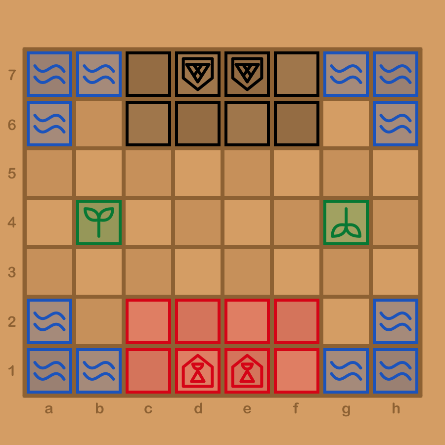

# muso kawa variant rules

*kawa* is portmanteau of "kala" and "waso". This variant wants to create more dynamic gameplay, and more importantly, improve competitiveness.

## Pieces

*akesi*, *kijetesantakalu*, and *soweli* are removed.

*waso* and *kala* have new complementary movement patterns. *waso* is like *kijetesantakalu* except it covers the furthest diagonal, and *akesi* has been merged into *kala*.

*waso* can still "jump" over pieces. *kala* can still go on *telo* spaces. However, *kala* cannot "jump" over pieces like *waso*, it is blocked and can only stack on top of other pieces in that direction.

## Board

The board is 8x7, with the center *telo* removed, and the corner *telo* reshaped.

There are two home spaces for each player on the back ranks.

## Other rules

Passing is removed.
